# Flujo del módulo de eventos — UniLab

Guía del recorrido completo con **ejemplo real** (evento «Congreso IOT con IA»): administración, jornadas con QR, inscripción del estudiante en el portal, asistencia automática por URL y verificación en admin (inscritos, asistencia y evidencias).

---

## Guía de inicio — Clonar y poner en marcha

Esta sección aplica a **todo el monorepo** (`unilab_back/` + `unilab_front/`). Siga estos pasos antes de ejecutar el flujo de eventos documentado más abajo.

### Requisitos

| Herramienta | Uso |
|-------------|-----|
| **Git** | Clonar el repositorio |
| **Docker** y **Docker Compose** | Opción recomendada (API + BD + frontend) |
| **Node.js 20+** y **PostgreSQL 14+** | Solo si desarrolla sin Docker (ver [unilab_back/docs/README.md](unilab_back/docs/README.md)) |

### Pasos después de clonar (Docker Compose — recomendado)

Desde la **raíz del monorepo** (carpeta `unilab/`):

```bash
git clone <URL-del-repositorio-unilab>
cd unilab
cp .env.example .env
docker compose up -d --build
docker compose exec api npx prisma db seed
```

| Paso | Qué hace |
|------|----------|
| `cp .env.example .env` | Crea variables de entorno (puerto PostgreSQL en host **5433**, API **3000**, front **8080**). |
| `docker compose up -d --build` | Levanta PostgreSQL, backend y frontend. |
| `prisma db seed` | Carga roles, usuarios de prueba, escuelas, proyectos y datos de ejemplo. **Ejecútelo la primera vez** o cuando la base esté vacía. |

**Comprobar que todo responde:**

| Servicio | URL |
|----------|-----|
| Portal y paneles (frontend) | http://localhost:8080 |
| API REST (desde el navegador) | http://localhost:3000/api |
| Swagger (documentación API) | http://localhost:3000/api-docs |
| PostgreSQL (desde tu PC, p. ej. DBeaver) | `localhost:5433`, usuario `postgres`, contraseña `postgres`, BD `unilab` |

Si cambia `POSTGRES_PORT`, `API_PORT` o `FRONT_PORT` en `.env`, ajuste las URLs anteriores.

### Desarrollo local sin Docker (resumen)

1. Cree la base `unilab` en PostgreSQL.
2. En `unilab_back/`: `cp .env.example .env`, configure `DATABASE_URL` (puerto **5433** si la BD es el contenedor `db`; **5432** si PostgreSQL es nativo).
3. `npm install` → `npx prisma migrate deploy` → `npx prisma generate` → `npm run prisma:seed` → `npm run dev`.
4. En `unilab_front/`: `npm install` → `npm start` (suele ser http://localhost:4200).

Detalle completo: [unilab_back/docs/README.md](unilab_back/docs/README.md).

### Usuarios y contraseñas de prueba (seed)

**Contraseña para todos los usuarios sembrados:** `Password123!`

| Rol | Correo | Uso típico |
|-----|--------|------------|
| **Administrador** | `admin@unilab.edu` | Panel `/admin`, crear eventos, jornadas, reportes |
| **Coordinador** | `coordinador@unilab.edu` | Panel `/coord`, reportes de eventos (sin crear evento) |
| **Profesor** | `profesor1@unilab.edu` / `profesor2@unilab.edu` | Panel `/prof`, proyectos y consulta de eventos |
| **Estudiante** | `estudiante1@unilab.edu` / `estudiante2@unilab.edu` / `estudiante3@unilab.edu` | Portal público, inscripción a eventos, asistencia QR |
| **Externo** | `externo@unilab.edu` | Acceso según permisos del rol |

Las cuentas del seed tienen `primer_login = false` (no piden cambio de contraseña al entrar). Si crea usuarios nuevos desde el panel, el primer acceso puede redirigir a `/cambiar-password`.

> **Solo entornos de desarrollo.** No use estas credenciales en producción.

### Mapa de rutas URL del frontend

Base por defecto con Docker: **`http://localhost:8080`**. Con `ng serve`: **`http://localhost:4200`**.

#### Acceso común

| Ruta | Descripción |
|------|-------------|
| `/login` | Login del **panel de gestión** (Administrador, Coordinador, Profesor tras autenticarse van a su shell) |
| `/` | **Portal público** (proyectos, escuelas; login de estudiante desde el modal del portal) |
| `/cambiar-password` | Cambio obligatorio si `primer_login = true` |
| `/dashboard` | Redirección según rol del usuario autenticado |

#### Portal estudiante / visitante autenticado (tema portal)

| Ruta | Descripción |
|------|-------------|
| `/` | Inicio del portal (escuelas, proyectos destacados) |
| `/eventos` | Listado de eventos |
| `/eventos/:id` | Detalle e inscripción |
| `/eventos/:id/asistencia?qr=...` | Registro de asistencia por QR (requiere sesión de estudiante) |
| `/mis-proyectos` | Proyectos del estudiante (rol Estudiante) |

#### Panel Administrador (`admin@unilab.edu`)

| Ruta | Descripción |
|------|-------------|
| `/admin` o `/admin/dashboard` | Dashboard |
| `/admin/eventos` | Listado de eventos |
| `/admin/eventos/crear` | Crear evento |
| `/admin/eventos/:id` | Detalle, jornadas, inscripciones, evidencias |
| `/admin/eventos/:id/reporte` | Reporte y % de asistencia |
| `/admin/escuelas`, `/admin/usuarios`, … | Otros módulos del menú lateral |

#### Panel Coordinador

| Ruta | Descripción |
|------|-------------|
| `/coord` o `/coord/dashboard` | Dashboard |
| `/coord/eventos` | Eventos (consulta y reportes) |
| `/coord/eventos/:id/reporte` | Reporte de asistencia |

#### Panel Profesor

| Ruta | Descripción |
|------|-------------|
| `/prof` o `/prof/dashboard` | Dashboard |
| `/prof/eventos` | Listado y detalle de eventos |
| `/prof/proyectos` | Gestión de proyectos asignados |

#### Asistencia QR (cualquier rol autenticado con inscripción)

| Ruta | Descripción |
|------|-------------|
| `/eventos/:id/asistencia?qr={uuid_jornada}` | Deeplink usado por el código QR; registra asistencia automática |

---

## Documento del flujo de eventos

**Entorno de las capturas:** frontend en `http://localhost:8080` (Docker Compose, `FRONT_PORT=8080`). El API suele estar en `http://localhost:3000`.

**Ver las capturas (Parte A):** en el editor solo verá código; las figuras aparecen en la **vista previa** → `Ctrl+K V` (al lado) o `Ctrl+Shift+V`. Archivos en [`docs/flujo-eventos/`](docs/flujo-eventos/).

---

## Resumen de roles y rutas

| Rol | Dónde entra | Crear evento / jornadas | Inscribirse | Asistencia QR | Reporte |
|-----|-------------|-------------------------|-------------|---------------|---------|
| **Administrador** | `/login` → `/admin/eventos` | Sí | No (gestiona inscritos) | Opcional (manual) | Sí |
| **Estudiante** | Portal `/` → **Eventos** | No | Sí (`/eventos/:id`) | Sí (deeplink) | No |

**Recomendación para probar el flujo:** use una ventana normal para **Administrador** y una **ventana de incógnito** para **Estudiante**, así no se mezclan las sesiones JWT en el mismo navegador.

---

## Parte A — Flujo paso a paso (con capturas)

> Las figuras de abajo se **renderizan en la vista previa** del Markdown (`Ctrl+K V`), no en el panel de código.

### Paso 1 — Inicio de sesión como Administrador

<p align="center">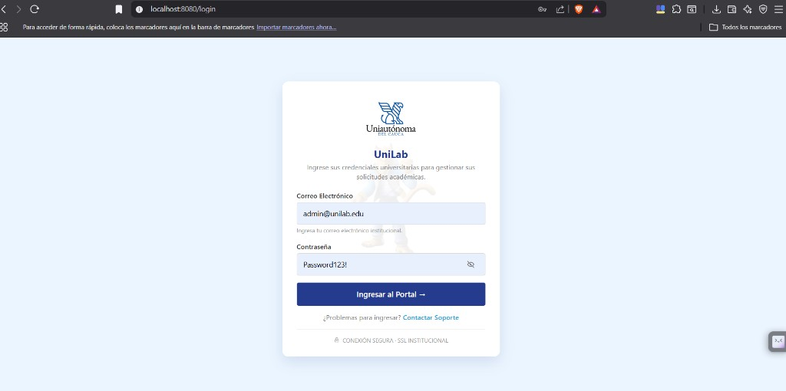</p>

*Figura 1 — Credenciales de administrador (`admin@unilab.edu`) y botón «Ingresar al Portal».*

1. Abra `http://localhost:8080/login`.
2. Ingrese las credenciales de administrador (en la prueba: correo **`admin@unilab.edu`** y la contraseña configurada en el seed).
3. Pulse **Ingresar al Portal**.

---

### Paso 2 — Módulo Eventos en el menú lateral

<p align="center">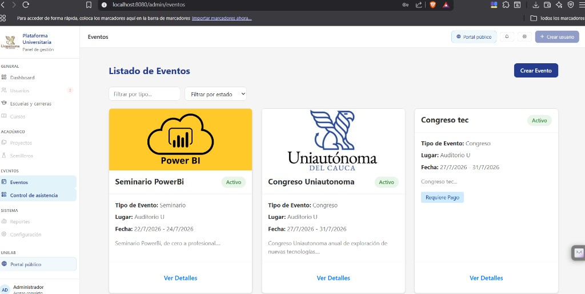</p>

*Figura 2 — Menú izquierdo **EVENTOS → Eventos** y botón **Crear Evento**.*

1. Tras el login, el panel redirige al área de administración.
2. En el menú izquierdo, sección **EVENTOS**, elija **Eventos**.
3. URL: `http://localhost:8080/admin/eventos`.

---

### Paso 3 — Crear evento (formulario)

<p align="center">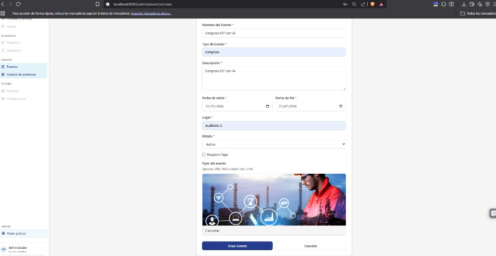</p>

*Figura 3 — Ejemplo «Congreso IOT con IA», fechas, lugar, estado Activo y flyer cargado.*

1. En el listado, pulse **Crear Evento** (esquina superior derecha).
2. Complete el formulario (`/admin/eventos/crear`). Ejemplo de la prueba:

| Campo | Valor de ejemplo |
|-------|------------------|
| Nombre | Congreso IOT con IA |
| Tipo | Congreso |
| Descripción | Congreso IOT con IA |
| Fechas | 22/07/2026 – 23/07/2026 |
| Lugar | Auditorio U |
| Estado | Activo |
| Requiere pago | Desmarcado (inscripción sin pago pendiente) |
| Flyer | Imagen opcional (JPEG/PNG/WebP, máx. 5 MB) |

3. Pulse **Crear Evento**. El sistema crea el registro (`POST /api/eventos`) y, si hay flyer, lo sube después (`POST /api/eventos/:id/flyer`).

**Validaciones (resumen):** nombre (mín. 3), descripción (mín. 10), fechas, lugar y estado obligatorios; backend valida con Zod (`eventoSchema`). El organizador es el usuario autenticado.

---

### Paso 4 — Detalle del evento recién creado

<p align="center">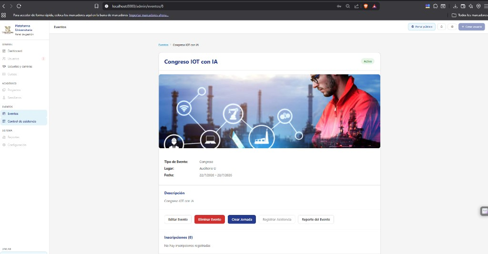</p>

*Figura 4 — Evento creado; botones Editar, Eliminar, **Crear Jornada**, Reporte; inscripciones en cero.*

Tras crear, la app abre el detalle, por ejemplo `http://localhost:8080/admin/eventos/8`.

Desde aquí puede:

- **Editar** o **Eliminar** el evento.
- **Crear Jornada** (obligatorio para asistencia por QR).
- **Reporte del Evento** (cuando haya inscritos y asistencias).
- Ver **Inscripciones** (inicialmente vacías).

---

### Paso 5 — Crear una jornada (horario de la sesión)

<p align="center">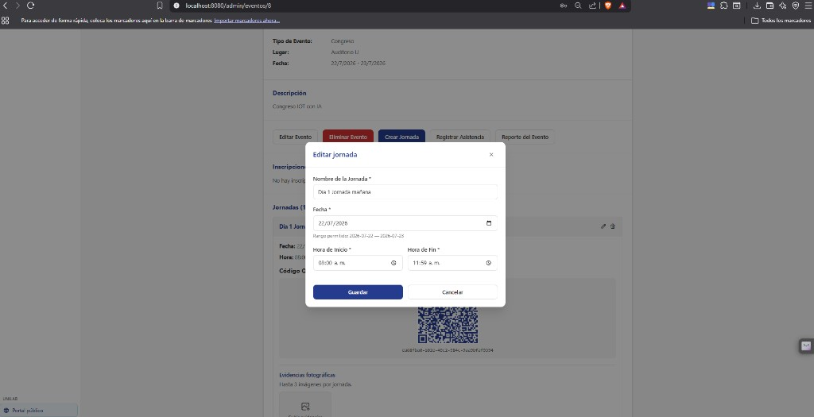</p>

*Figura 5 — Nombre, fecha dentro del rango del evento y horario de la jornada.*

1. Pulse **Crear Jornada**.
2. Complete el modal / formulario:

| Campo | Ejemplo |
|-------|---------|
| Nombre de la jornada | Día 1 jornada mañana |
| Fecha | 22/07/2026 (dentro del rango del evento) |
| Hora inicio / fin | 08:00 – 11:59 |

3. **Guardar** → `POST /api/eventos/:id/jornadas`. El backend asigna un **`codigo_qr`** único (UUID) a esa jornada.

---

### Paso 6 — Código QR y URL de asistencia automática

<p align="center">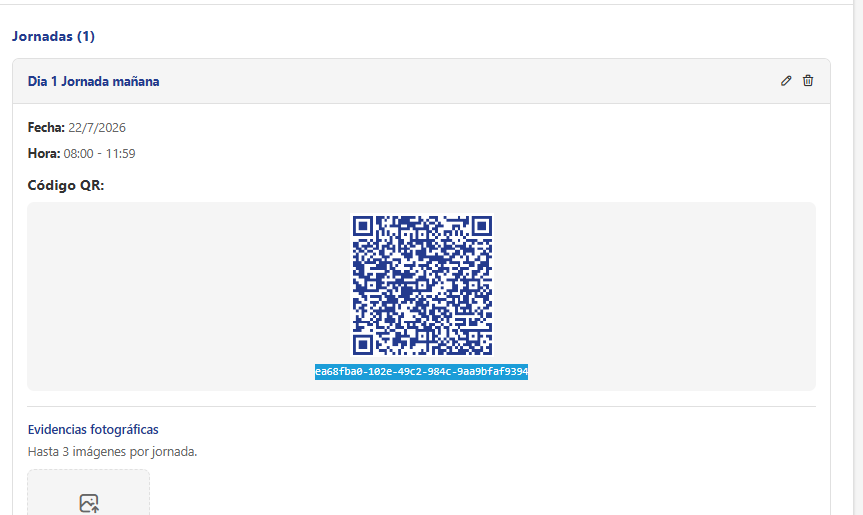</p>

*Figura 6 — QR de la jornada, UUID copiable y sección de evidencias fotográficas.*

En el detalle del evento, sección **Jornadas**, cada jornada muestra:

- Fecha y horario.
- **Código QR** (imagen) y, debajo, el **UUID en texto** (copiable).
- Zona **Evidencias fotográficas** (hasta 3 imágenes por jornada; staff).

El QR codifica esta URL (deeplink):

```text
http://localhost:8080/eventos/{id_evento}/asistencia?qr={codigo_qr}
```

**Ejemplo con el evento id `8`:**

```text
http://localhost:8080/eventos/8/asistencia?qr=ea68fba0-102e-49c2-984c-9aa9bfaf9394
```

(Sustituya `8` por su `id_evento` y el query `qr` por el UUID que aparece bajo el QR de **esa** jornada, como en la figura 6.)

Para **probar sin escáner físico:** copie ese UUID, arme la URL y ábrala **después** de que el estudiante haya iniciado sesión e inscrito (pasos 7–10).

---

### Paso 7 — Estudiante: login en ventana de incógnito

<p align="center">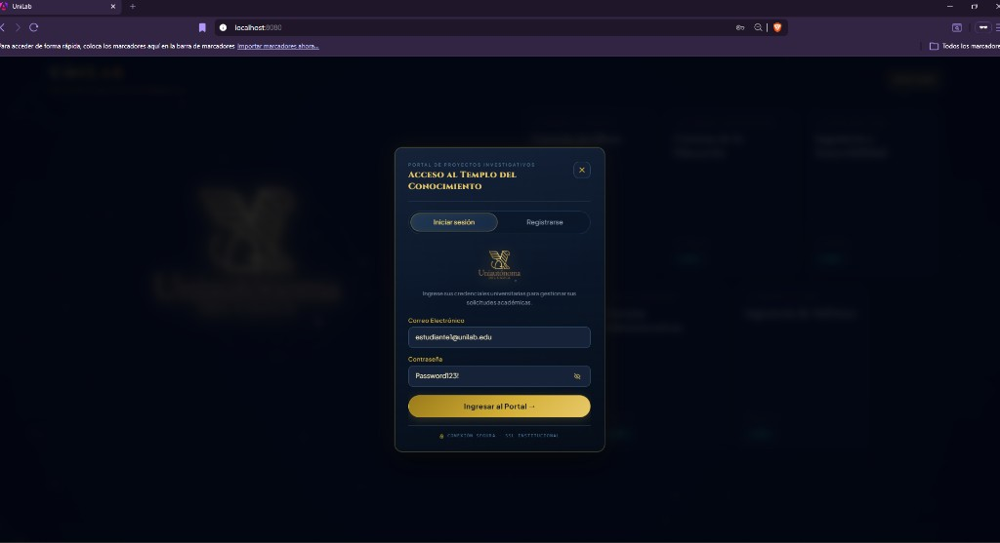</p>

*Figura 7 — Ventana de incógnito; acceso con `estudiante1@unilab.edu`.*

1. Abra una **ventana de incógnito** (sesión separada del admin).
2. Entre al portal: `http://localhost:8080/` (pantalla de acceso UniLab / portal de proyectos).
3. Inicie sesión como estudiante (en la prueba: **`estudiante1@unilab.edu`** y contraseña del seed).

> Si su entorno usa otro puerto (p. ej. `ng serve` en `4200`), cambie solo el origen; la ruta `/eventos/:id/asistencia?qr=...` es la misma.

---

### Paso 8 — Ir al módulo Eventos del portal

<p align="center">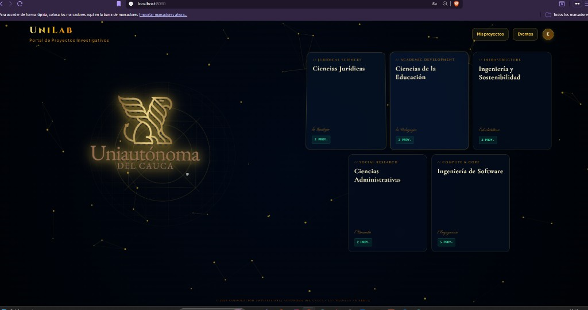</p>

*Figura 8 — Tras el login, en la barra superior pulse **Eventos**.*

En la barra superior del portal, pulse **Eventos** (junto a «Mis proyectos»). Llegará al listado `http://localhost:8080/eventos` con las tarjetas de eventos activos, incluido el creado en el paso 3.

---

### Paso 9 — Abrir el evento (antes de inscribirse)

<p align="center">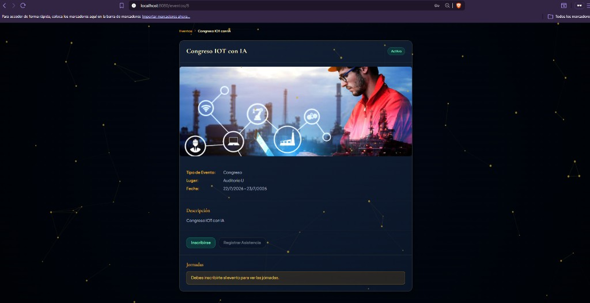</p>

*Figura 9 — Botón **Inscribirse**; asistencia deshabilitada; aviso de que debe inscribirse para ver jornadas.*

Pulse la tarjeta o **Ver detalles** → `http://localhost:8080/eventos/8`.

- Botón **Inscribirse** disponible.
- **Registrar asistencia** deshabilitado hasta inscribirse.
- Mensaje en jornadas: *debe inscribirse al evento para ver las jornadas*.

---

### Paso 10 — Inscripción al evento

<p align="center">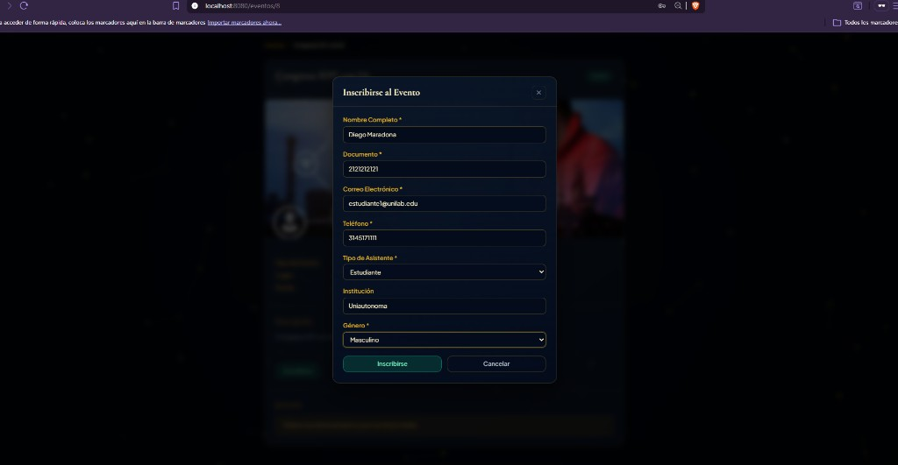</p>

*Figura 10 — Formulario de inscripción completado antes de confirmar.*

1. Pulse **Inscribirse**.
2. Complete el modal (ejemplo de la prueba):

| Campo | Ejemplo |
|-------|---------|
| Nombre completo | Diego Maradona |
| Documento | 2121212121 |
| Correo | estudiante1@unilab.edu |
| Teléfono | 3145171111 |
| Tipo asistente | Estudiante |
| Institución | Uniautónoma |
| Género | Masculino |

3. **Inscribirse** → `POST /api/eventos/:id/inscripciones`. Si el evento no requiere pago, el estado de pago queda exento / sin bloqueo.

Tras confirmar, el detalle muestra al usuario como inscrito y permite ver jornadas (y usar asistencia cuando el pago esté confirmado, si aplica).

---

### Paso 11 — Asistencia por QR (misma sesión incógnito del estudiante)

*Figura 11 — Use el QR o la URL del paso 6 (`id_evento` + `qr`); con sesión de estudiante activa, la asistencia se registra sola.*

**Sin cerrar la sesión del estudiante:**

1. Escanee el QR de la figura 6 **o** pegue en la barra de direcciones:

   `http://localhost:8080/eventos/8/asistencia?qr=ea68fba0-102e-49c2-984c-9aa9bfaf9394`

   (Sustituya el `qr` por el UUID de su jornada.)

2. La ruta `/eventos/:id/asistencia` exige login: al estar el estudiante autenticado, carga `AsistenciaQrComponent`, lee `qr` del query string y llama a `POST /api/eventos/asistencias/registrar`.
3. Debe aparecer la pantalla de confirmación **«¡Registro exitoso!» / «Asistencia registrada correctamente»** (figura 12). Si se repite el mismo QR en la misma jornada, el backend responde 409 (asistencia ya registrada).

<p align="center">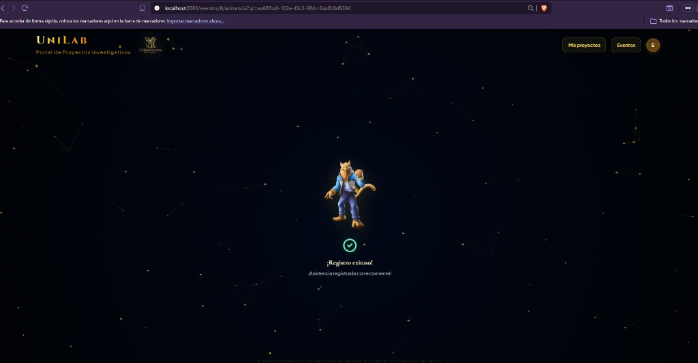</p>

*Figura 12 — URL de asistencia con `id` y `qr` en la barra de direcciones; mensaje de éxito en el portal del estudiante.*

**Reglas del backend:** inscripción activa en el evento de la jornada; QR válido; pago confirmado si `requiere_pago`; una asistencia por inscripción y jornada.

---

### Paso 12 — Verificación en Administrador (inscritos y evidencias en jornada)

<p align="center">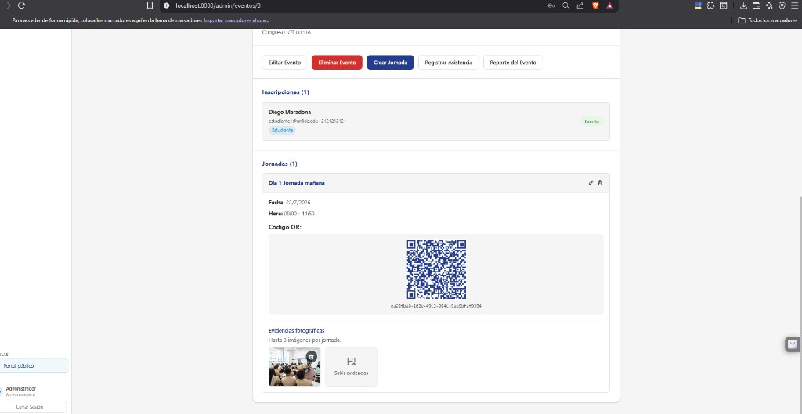</p>

*Figura 13 — Inscripción del estudiante, jornada con QR y evidencia subida en la jornada.*

Vuelva a la ventana del **Administrador** (`/admin/eventos/8`):

1. **Inscripciones:** aparece el estudiante inscrito (ej. Diego Maradona, badge Estudiante, estado de pago acorde al evento).
2. **Jornadas:** sigue visible el QR; puede **subir evidencias fotográficas** de la jornada (hasta 3 imágenes), como en la figura 13.
3. Tras el paso 11, la asistencia queda registrada en base de datos.

---

### Paso 13 — Reporte del evento (porcentaje de asistencia)

<p align="center">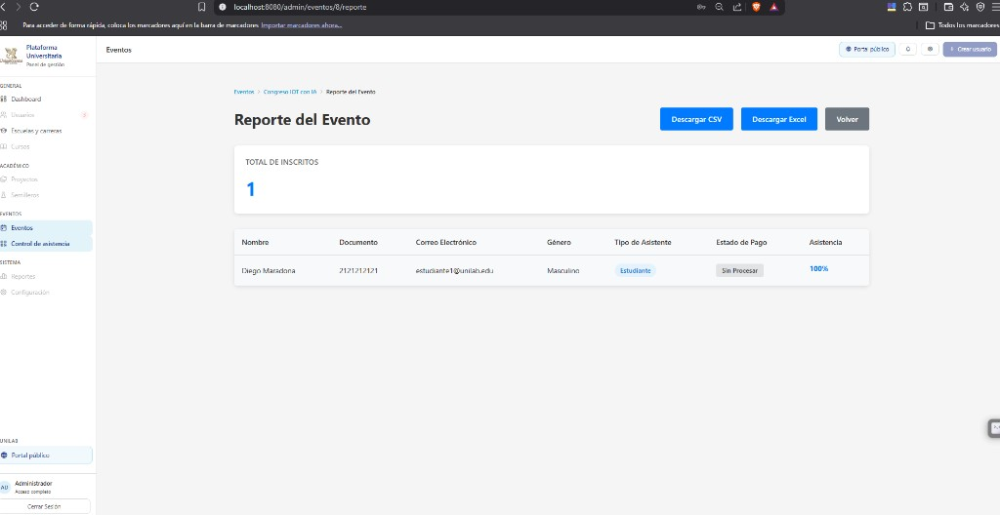</p>

*Figura 14 — Reporte en `/admin/eventos/8/reporte`: total de inscritos y columna **Asistencia** con el porcentaje (ej. 100 % con una jornada y una asistencia registrada).*

1. En el detalle del evento, pulse **Reporte del Evento** o abra `http://localhost:8080/admin/eventos/8/reporte`.
2. Revise **Total de inscritos** y la tabla: cada fila muestra datos del inscrito y el **% de asistencia**:

   `(asistencias del inscrito ÷ total de jornadas del evento) × 100`

3. Opcional: **Descargar CSV** o **Descargar Excel** (`GET .../reportes/export/csv` y `.../export/excel`).

---

## Parte B — Checklist rápido (punta a punta)

| # | Captura | Quién | Acción |
|---|---------|--------|--------|
| 1 | Fig. 1 | Admin | Login → menú **Eventos** |
| 2 | Fig. 2 | Admin | **Crear Evento** |
| 3 | Fig. 3–4 | Admin | Guardar evento y abrir detalle |
| 4 | Fig. 5–6 | Admin | **Crear Jornada**; anotar UUID del QR |
| 5 | Fig. 7–8 | Estudiante (incógnito) | Login portal → **Eventos** |
| 6 | Fig. 9–10 | Estudiante (incógnito) | Detalle → **Inscribirse** |
| 7 | Fig. 11–12 | Estudiante (incógnito) | URL/QR de asistencia → confirmación exitosa |
| 8 | Fig. 13 | Admin | Detalle: inscrito y evidencias en jornada |
| 9 | Fig. 14 | Admin | **Reporte del evento**: % asistencia y exportes |

Si el evento **requiere pago**, el administrador debe confirmar el pago (`PATCH /api/inscripciones/:id/pago` con `confirmado`) antes de que el estudiante vea jornadas o registre asistencia.

---

## Parte C — Referencia técnica

### API relevante

| Acción | Método y ruta |
|--------|----------------|
| Crear evento | `POST /api/eventos` |
| Subir flyer | `POST /api/eventos/:id/flyer` |
| Crear jornada | `POST /api/eventos/:id/jornadas` |
| Inscribirse | `POST /api/eventos/:id/inscripciones` |
| Registrar asistencia | `POST /api/eventos/asistencias/registrar` body `{ "codigo_qr": "..." }` |
| Reporte | `GET /api/eventos/:id/reportes` |
| Evidencias jornada | `POST /api/jornadas/:id/evidencias` |

### Rutas Angular

- Admin: `unilab_front/src/app/app.routes.ts` → `eventosShellChildren` bajo `/admin`.
- Portal estudiante: `path: 'eventos'` bajo el shell del portal (`/`).
- Asistencia: `path: 'eventos/:id/asistencia'` (global y dentro del portal).

### Código del deeplink QR

Generado en `unilab_front/src/app/features/eventos/evento-detalle.component.ts`:

`{window.location.origin}/eventos/{idEvento}/asistencia?qr={jornada.codigo_qr}`

### Archivos de implementación

- Rutas backend: `unilab_back/src/routes/evento.routes.ts`
- Reglas de negocio: `unilab_back/src/services/evento.service.ts`
- Schemas Zod: `unilab_back/src/middlewares/validation/schemas/index.ts`

### Mapa de archivos de imagen

| Paso | Archivo |
|------|---------|
| 1 | `docs/flujo-eventos/01-login-admin.png` |
| 2 | `docs/flujo-eventos/02-listado-eventos.png` |
| 3 | `docs/flujo-eventos/03-crear-evento.png` |
| 4 | `docs/flujo-eventos/04-detalle-evento-admin.png` |
| 5 | `docs/flujo-eventos/05-crear-jornada.png` |
| 6 y 11 (referencia QR) | `docs/flujo-eventos/06-jornada-qr.png` |
| 7 | `docs/flujo-eventos/07-login-estudiante.png` |
| 8 | `docs/flujo-eventos/08-portal-eventos.png` |
| 9 | `docs/flujo-eventos/09-detalle-evento-estudiante.png` |
| 10 | `docs/flujo-eventos/10-inscripcion.png` |
| 11–12 (confirmación asistencia) | `docs/flujo-eventos/12-asistencia-exitosa.png` |
| 13 (detalle admin) | `docs/flujo-eventos/11-admin-inscritos-evidencias.png` |
| 14 (reporte) | `docs/flujo-eventos/13-reporte-evento.png` |
