# Flujo del módulo de proyectos — UniLab (NOSIS)

Guía del recorrido completo con **ejemplo real** (proyecto «MIDAS AUTOMATIZACION»): el estudiante inicia sesión en el portal, crea la solicitud en **Mis proyectos**, la profesora de la escuela lo autoriza en el panel de gestión y, al publicar, el proyecto queda visible en el portal público y en el listado del estudiante.

> **Eventos y proyectos son módulos distintos.** En la barra del portal el botón **Eventos** abre congresos, jornadas y asistencia QR (ver [FLUJO-MODULO-EVENTOS.md](FLUJO-MODULO-EVENTOS.md)). La solicitud para integrar un proyecto al aplicativo web se hace desde **Mis proyectos** → **Nuevo proyecto**. Las capturas de esta guía siguen ese camino.

---

## Guía de inicio — Clonar y poner en marcha

Esta sección aplica a **todo el monorepo** (`unilab_back/` + `unilab_front/`). Siga estos pasos antes de ejecutar el flujo documentado más abajo.

### Requisitos

| Herramienta | Uso |
|-------------|-----|
| **Git** | Clonar el repositorio |
| **Docker** y **Docker Compose** | Opción recomendada (API + BD + frontend) |
| **Node.js 20+** y **PostgreSQL 14+** | Solo si desarrolla sin Docker (ver [unilab_back/docs/README.md](unilab_back/docs/README.md)) |

### Pasos después de clonar (Docker Compose — recomendado)

Desde la **raíz del monorepo** (carpeta `unilab/`):

```bash
git clone <URL-del-repositorio-unilab>
cd unilab
cp .env.example .env
docker compose up -d --build
docker compose exec api npx prisma db seed
```

| Paso | Qué hace |
|------|----------|
| `cp .env.example .env` | Crea variables de entorno (puerto PostgreSQL en host **5433**, API **3000**, front **8080**). |
| `docker compose up -d --build` | Levanta PostgreSQL, backend y frontend. |
| `prisma db seed` | Carga roles, usuarios de prueba, escuelas, proyectos y datos de ejemplo. **Ejecútelo la primera vez** o cuando la base esté vacía. |

**Comprobar que todo responde:**

| Servicio | URL |
|----------|-----|
| Portal y paneles (frontend) | http://localhost:8080 |
| API REST (desde el navegador) | http://localhost:3000/api |
| Swagger (documentación API) | http://localhost:3000/api-docs |
| PostgreSQL (desde tu PC, p. ej. DBeaver) | `localhost:5433`, usuario `postgres`, contraseña `postgres`, BD `unilab` |

### Usuarios de esta guía (seed)

**Contraseña para todos:** `Password123!`

| Rol | Correo | Persona en el ejemplo |
|-----|--------|------------------------|
| **Estudiante** | `estudiante1@unilab.edu` | Sofía Estudiante |
| **Profesor** | `profesor1@unilab.edu` | María Profesora Líder (`DOC-001`), Escuela de Software y Desarrollo Tecnológico |

Las cuentas del seed tienen `primer_login = false`. **Use una ventana normal para el estudiante y una de incógnito para la profesora**, así no se mezclan las sesiones JWT.

> **Solo entornos de desarrollo.** No use estas credenciales en producción.

---

## Mapa rápido del flujo

```text
Estudiante (portal)                         Profesora (panel /prof)              Portal público
───────────────────                         ───────────────────────              ───────────────
1. Login modal
2. Inicio (escuelas)
3. Mis proyectos
4. Nuevo proyecto + imágenes
5. Crear y enviar a revisión  ──────────►  7. Mi panel
   (estado: en_revision)                   8. Pendientes de aprobar
                                           9–10. Revisar ficha
                                           11–12. Aprobar y publicar  ──────►  13. Inicio (conteo)
                                                                              14. Escuela /escuelas/5
                                                                              15. Detalle /proyectos/14
                                                                              + Mis proyectos (PUBLICADO)
```

**Estados del proyecto:** `borrador` → `en_revision` → `publicado` (en esta guía la profesora aprueba y publica en un solo paso). También existen `aprobado` y `rechazado`.

**Regla de visibilidad:** el portal público (`GET /api/public/proyectos`) solo muestra proyectos con estado `publicado`. Hasta entonces, el trabajo vive en **Mis proyectos** del estudiante y en **Pendientes de aprobar** de la profesora.

---

## Documento del flujo de proyectos

**Entorno de las capturas:** frontend en `http://localhost:8080` (Docker Compose, `FRONT_PORT=8080`). El API suele estar en `http://localhost:3000`.

**Ver las capturas:** en el editor solo verá código; las figuras aparecen en la **vista previa** → `Ctrl+K V` (al lado) o `Ctrl+Shift+V`. Archivos en [`flujo-proyectos/`](flujo-proyectos/) (junto a esta guía, dentro de `docs/`).

---

## Parte A — Flujo paso a paso (con capturas)

> Las figuras de abajo se **renderizan en la vista previa** del Markdown (`Ctrl+K V`), no en el panel de código.

### Fase 1 — El estudiante solicita publicar su proyecto

### Paso 1 — Inicio de sesión como Estudiante

<p align="center">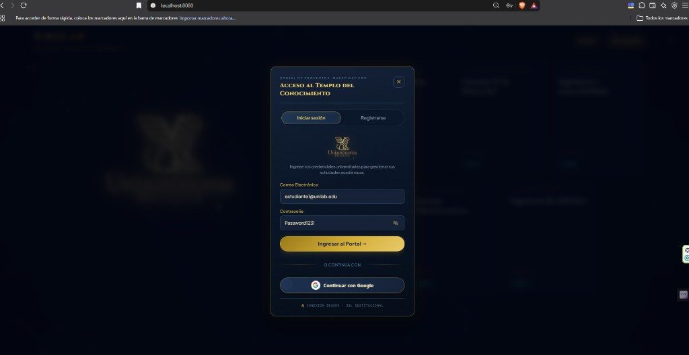</p>

*Figura 1 — Modal «Acceso al templo del conocimiento»; pestaña **Iniciar sesión** con `estudiante1@unilab.edu`.*

1. Abra `http://localhost:8080/` (portal público).
2. Pulse **Iniciar sesión**. Se abre el modal del portal (no la ruta `/login` del panel de gestión).
3. Ingrese **`estudiante1@unilab.edu`** / **`Password123!`**.
4. Pulse **Ingresar al Portal**.

El login de estudiante ocurre **en el portal**. El de profesora, más adelante, es en `/login` y redirige a `/prof`.

---

### Paso 2 — Inicio del portal (estudiante autenticado)

<p align="center">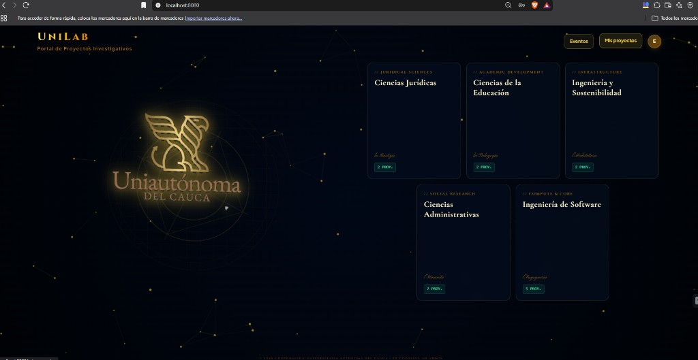</p>

*Figura 2 — Tras el login: avatar «E», botones **Eventos** y **Mis proyectos**, tarjetas de escuela a la derecha.*

En la esquina superior derecha quedan:

| Botón | Destino | Para este flujo |
|-------|---------|-----------------|
| **Eventos** | `/eventos` | No. Es el módulo de congresos y asistencia. |
| **Mis proyectos** | `/mis-proyectos` | **Sí.** Aquí se crea la solicitud de publicación. |
| Avatar **E** | Menú de perfil | Cerrar sesión, etc. |

Pulse **Mis proyectos**.

---

### Paso 3 — Mis proyectos (punto de partida)

<p align="center">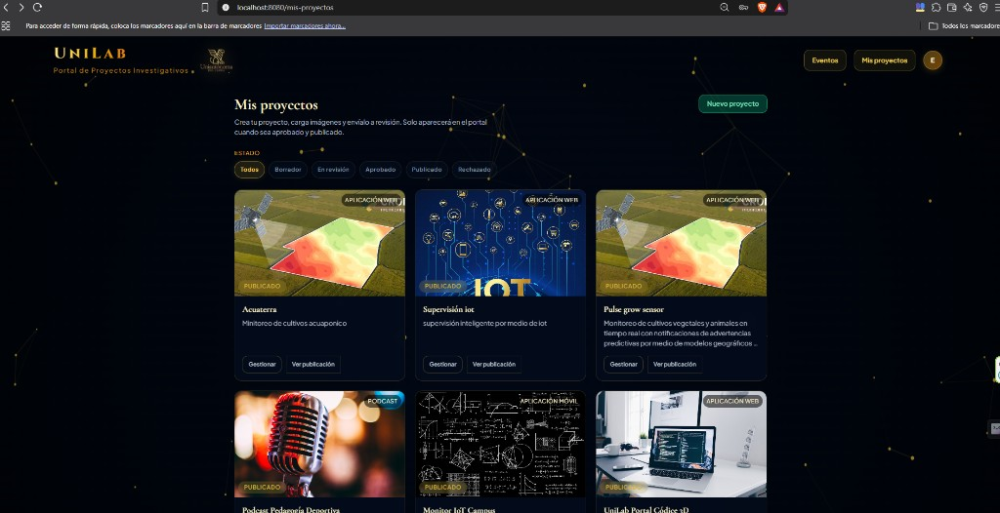</p>

*Figura 3 — `http://localhost:8080/mis-proyectos`: filtros de estado y botón verde **Nuevo proyecto**.*

La pantalla explica: *«Crea tu proyecto, carga imágenes y envíalo a revisión. Solo aparecerán en el portal cuando sea aprobado y publicado.»*

Filtros de **ESTADO:** Todos, Borrador, En revisión, Aprobado, Publicado, Rechazado.

Pulse **Nuevo proyecto** → `http://localhost:8080/mis-proyectos/nuevo`.

---

### Paso 4 — Formulario «Nuevo proyecto»

<p align="center">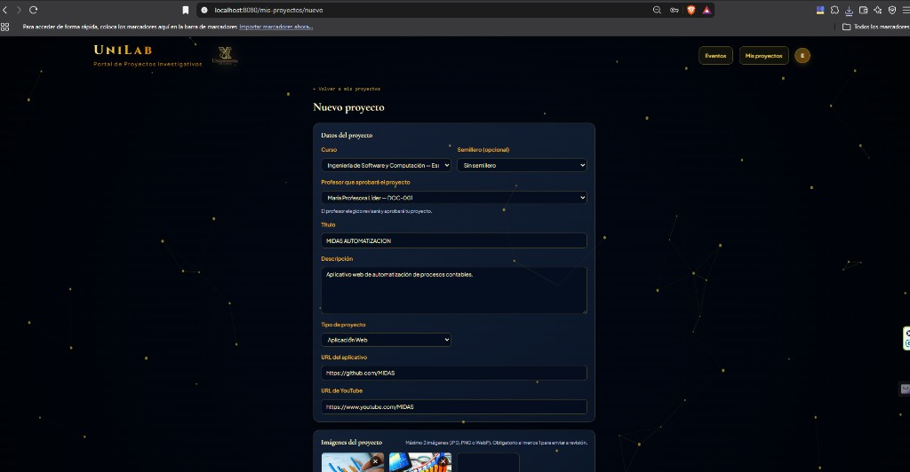</p>

*Figura 4 — Datos del proyecto MIDAS AUTOMATIZACION; profesora asignada María Profesora Líder.*

Complete el formulario. Ejemplo de la prueba:

| Campo | Valor de ejemplo |
|-------|------------------|
| Curso | Ingeniería de Software y Computación |
| Semillero | Sin semillero (opcional) |
| **Profesor que aprobará el proyecto** | **María Profesora Líder – DOC-001** |
| Título | MIDAS AUTOMATIZACION |
| Descripción | Aplicativo web de automatización de procesos contables. |
| Tipo de proyecto | Aplicación Web |
| URL del aplicativo | `https://github.com/MIDAS` |
| URL de YouTube | `https://www.youtube.com/MIDAS` |

El profesor elegido es quien verá la solicitud en **Pendientes de aprobar**. En el seed, María pertenece a la Escuela de Software; debe coincidir con el curso del proyecto.

**Imágenes:** máximo 3 (JPG, PNG o WebP). **Al menos 1 es obligatoria** para enviar a revisión.

---

### Paso 5 — Enviar la solicitud a revisión

<p align="center">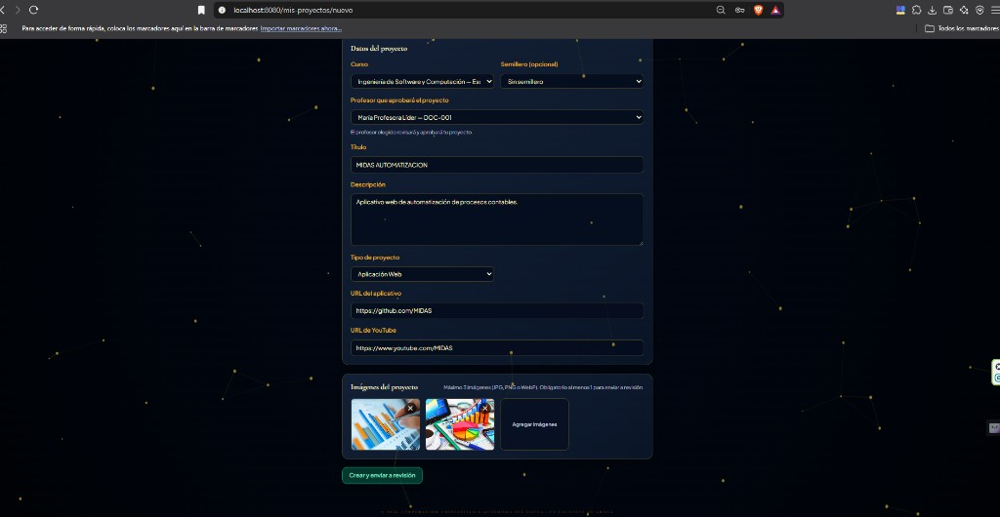</p>

*Figura 5 — Imágenes cargadas y botón verde **Crear y enviar a revisión**.*

1. Cargue al menos una imagen del proyecto.
2. Pulse **Crear y enviar a revisión**.

El frontend crea el proyecto (`POST /api/proyectos`), sube las imágenes (`POST /api/proyectos/:id/imagenes`) y pasa el estado a `en_revision` (`PATCH /api/proyectos/:id/estado`).

---

### Paso 6 — Confirmación: solicitud enviada

<p align="center">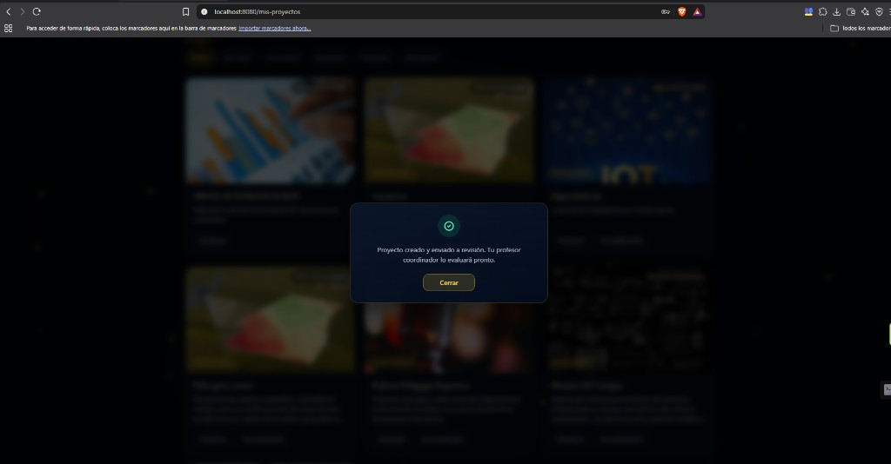</p>

*Figura 6 — «Proyecto creado y enviado a revisión. Tu profesor coordinador lo evaluará pronto.»*

El estudiante vuelve a `/mis-proyectos`. El proyecto **aún no** aparece en el portal público ni en las tarjetas de escuela. Cierre el modal y, si quiere comprobarlo, filtre por **En revisión**.

A partir de aquí la acción pasa a la profesora. **No cierre solo la pestaña:** abra una **ventana de incógnito** (o cierre sesión) para no reutilizar el JWT del estudiante.

---

### Fase 2 — La profesora autoriza y publica

### Paso 7 — Panel de gestión de la profesora

<p align="center">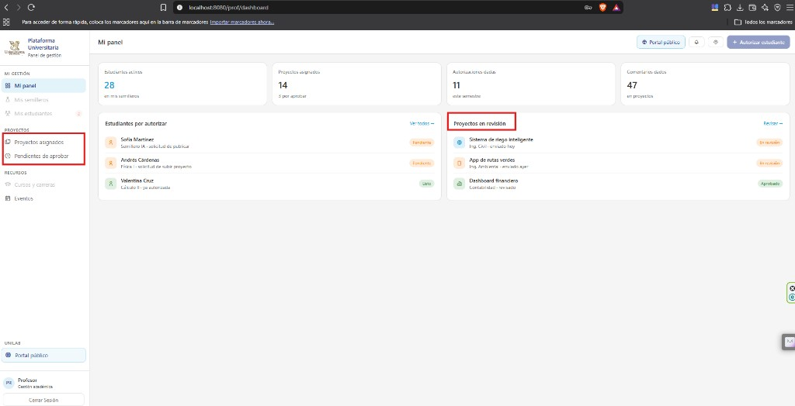</p>

*Figura 7 — `http://localhost:8080/prof/dashboard`: menú **PROYECTOS** y bloque **Proyectos en revisión**.*

1. En incógnito abra `http://localhost:8080/login` (panel de gestión, no el modal del portal).
2. Inicie sesión como **`profesor1@unilab.edu`** / **`Password123!`**.
3. El sistema redirige a `/prof/dashboard` (**Mi panel**).

En el menú izquierdo, sección **PROYECTOS**:

- **Proyectos asignados** → `/prof/proyectos`
- **Pendientes de aprobar** → `/prof/pendientes` (filtro `en_revision`)

En el dashboard también aparece el resumen **Proyectos en revisión**.

---

### Paso 8 — Cola «Pendientes de aprobar»

<p align="center">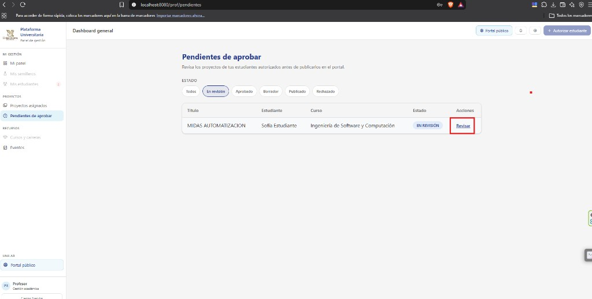</p>

*Figura 8 — `http://localhost:8080/prof/pendientes`: MIDAS AUTOMATIZACION, Sofía Estudiante, estado EN REVISIÓN, enlace **Revisar**.*

1. Pulse **Pendientes de aprobar**.
2. Deje el filtro en **En revisión**.
3. En la fila del proyecto, pulse **Revisar**.

---

### Paso 9 — Ficha de revisión

<p align="center">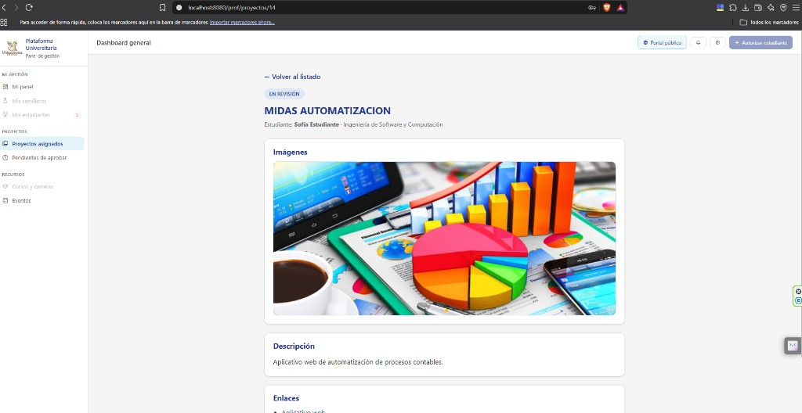</p>

*Figura 9 — `http://localhost:8080/prof/proyectos/14`: badge EN REVISIÓN, estudiante, imágenes y descripción.*

La profesora ve el mismo contenido que envió el estudiante: título, curso, imágenes, descripción y enlaces (aplicativo / YouTube). El `id` en la URL es el del proyecto (en el ejemplo, **14**).

---

### Paso 10 — Aprobar y publicar

<p align="center">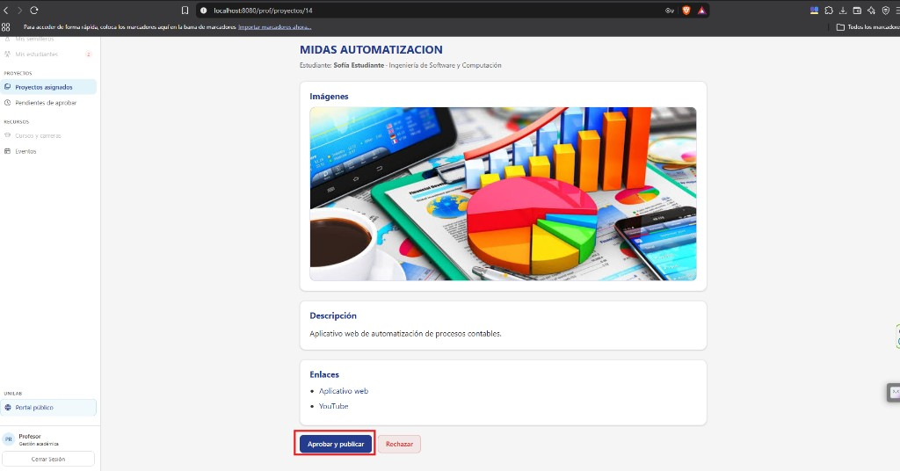</p>

*Figura 10 — Acciones al pie: **Aprobar y publicar** (publica en el portal) o **Rechazar**.*

- **Aprobar y publicar** — pasa de `en_revision` a `publicado` (un solo paso). El proyecto queda visible en el portal.
- **Rechazar** — pasa a `rechazado`; no sale al público.

Pulse **Aprobar y publicar**.

---

### Paso 11 — Confirmar la publicación

<p align="center">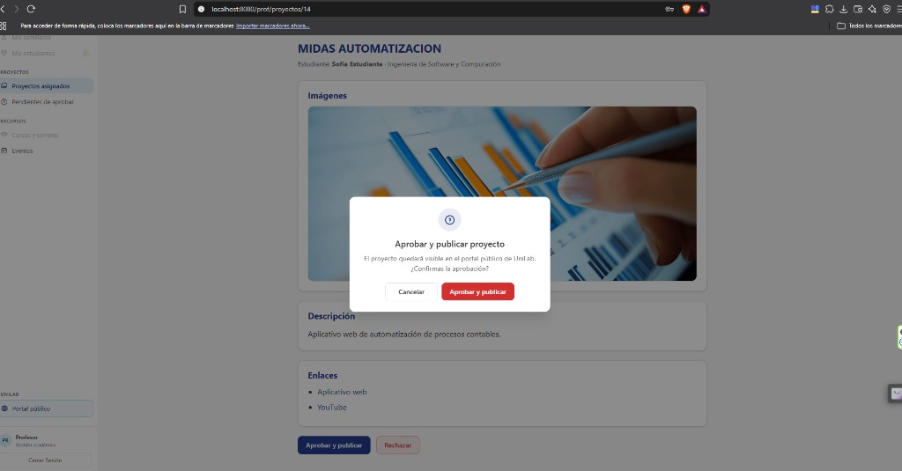</p>

*Figura 11 — «El proyecto quedará visible en el portal público de Unilab. ¿Confirmas la aprobación?»*

Confirme. El backend ejecuta `PATCH /api/proyectos/:id/estado` con `{ "estado_proyecto": "publicado" }` y registra `fecha_publicacion` e `id_aprobador`.

---

### Paso 12 — Publicación exitosa

<p align="center">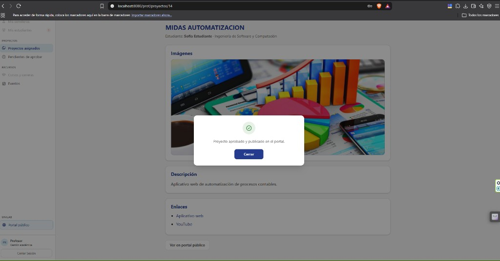</p>

*Figura 12 — «Proyecto aprobado y publicado en el portal.» El botón de la ficha pasa a **Ver en portal público**.*

Cierre el modal. Desde aquí puede abrir el portal público o volver al listado. El ciclo de autorización administrativa ya terminó.

---

### Fase 3 — Verificar en el portal público (y en Mis proyectos)

### Paso 13 — Inicio del portal (conteo de la escuela)

<p align="center">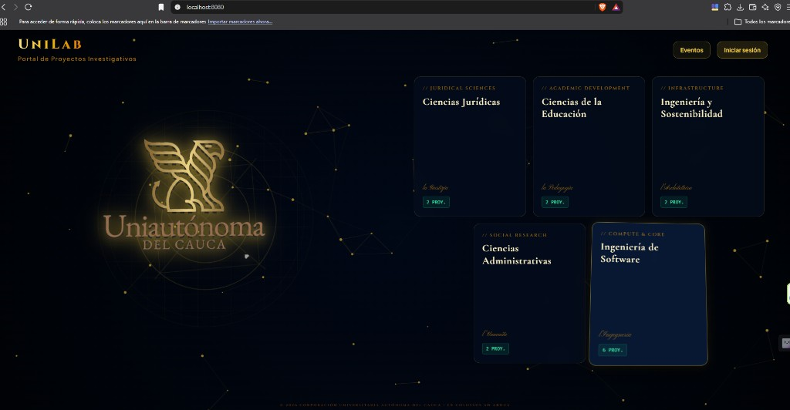</p>

*Figura 13 — `http://localhost:8080/`: Ingeniería de Software muestra más proyectos publicados (en la prueba, 6 PROY.).*

Abra el portal **sin** sesión de profesora (o use **Portal público** en el panel). El conteo de cada tarjeta sale de `GET /api/public/escuelas` (`total_proyectos_publicados`). Pulse la tarjeta **Ingeniería de Software**.

---

### Paso 14 — Proyectos publicados de la escuela

<p align="center">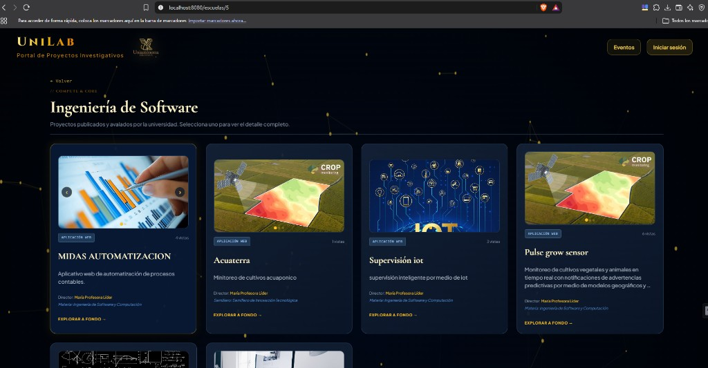</p>

*Figura 14 — `http://localhost:8080/escuelas/5`: MIDAS AUTOMATIZACION aparece como APLICACIÓN WEB, director María Profesora Líder.*

Solo hay proyectos `publicado`. Pulse **EXPLORAR A FONDO** en la tarjeta de MIDAS (o abra `/proyectos/14`).

---

### Paso 15 — Ficha pública del proyecto

<p align="center">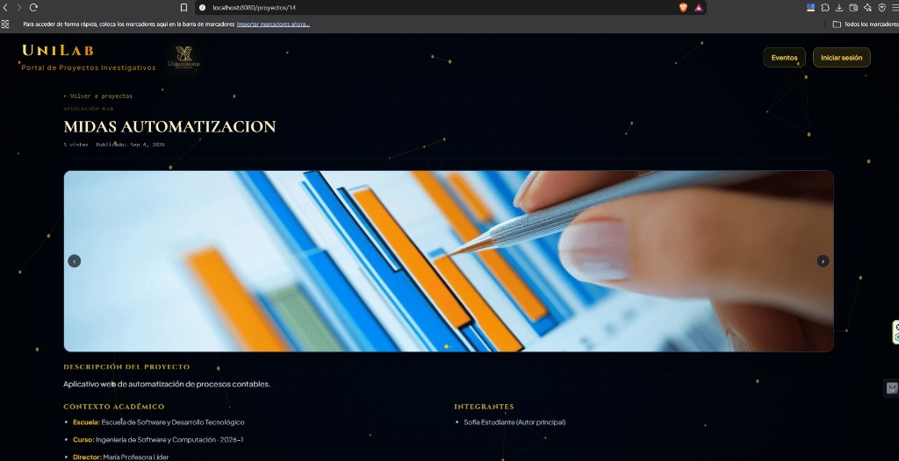</p>

*Figura 15 — `http://localhost:8080/proyectos/14`: galería, descripción, escuela, curso, director e integrantes (Sofía Estudiante, autor principal).*

Esta es la vista que ve cualquier visitante. Coincide con lo enviado en el paso 4 y autorizado en los pasos 10–12.

**Comprobación extra (estudiante):** vuelva a iniciar sesión como `estudiante1@unilab.edu`, abra **Mis proyectos** y filtre **Publicado**. El mismo proyecto muestra el badge **PUBLICADO**, **Gestionar** y **Ver publicación** (este último abre la ficha pública).

---

## Parte B — Checklist rápido (punta a punta)

| # | Captura | Quién | Acción |
|---|---------|--------|--------|
| 1 | Fig. 1 | Estudiante | Portal `/` → modal **Iniciar sesión** |
| 2 | Fig. 2 | Estudiante | Inicio autenticado → **Mis proyectos** (no Eventos) |
| 3 | Fig. 3 | Estudiante | **Nuevo proyecto** |
| 4 | Fig. 4–5 | Estudiante | Formulario + imágenes → **Crear y enviar a revisión** |
| 5 | Fig. 6 | Estudiante | Confirmación; estado `en_revision` |
| 6 | Fig. 7 | Profesora (incógnito) | `/login` → `/prof/dashboard` |
| 7 | Fig. 8 | Profesora | **Pendientes de aprobar** → **Revisar** |
| 8 | Fig. 9–10 | Profesora | Ficha → **Aprobar y publicar** |
| 9 | Fig. 11–12 | Profesora | Confirmar; estado `publicado` |
| 10 | Fig. 13–15 | Cualquiera | Portal → escuela → detalle público |
| 11 | (Fig. 3 otra vez) | Estudiante | **Mis proyectos** → filtro Publicado |

Si **Rechazar**, el proyecto no sale al público. El estudiante lo ve en **Mis proyectos** con estado Rechazado.

---

## Parte C — Referencia técnica

### Máquina de estados

```text
borrador ──(creador + ≥1 imagen)──► en_revision
                                       ├── (profesora) ──► publicado   ← este flujo
                                       ├── (profesora) ──► aprobado    (luego se puede publicar)
                                       └── (profesora) ──► rechazado
aprobado ──► publicado
publicado / rechazado: sin más transiciones
```

### API relevante

| Acción | Método y ruta |
|--------|----------------|
| Crear proyecto | `POST /api/proyectos` (rol Estudiante) |
| Subir imágenes | `POST /api/proyectos/:id/imagenes` |
| Enviar a revisión / aprobar | `PATCH /api/proyectos/:id/estado` body `{ "estado_proyecto": "en_revision" \| "publicado" \| "rechazado" }` |
| Escuelas con conteo público | `GET /api/public/escuelas` |
| Proyectos publicados de una escuela | `GET /api/public/proyectos?id_escuela=` |
| Detalle público | `GET /api/public/proyectos/:id` (404 si no está `publicado`) |

### Rutas Angular

| Quién | Ruta |
|-------|------|
| Portal (visitante o estudiante) | `/`, `/escuelas/:id`, `/proyectos/:id` |
| Estudiante | `/mis-proyectos`, `/mis-proyectos/nuevo`, `/mis-proyectos/:id` |
| Profesora | `/login` → `/prof/dashboard`, `/prof/pendientes`, `/prof/proyectos/:id` |

Definidas en `unilab_front/src/app/app.routes.ts`.

### Archivos de implementación

- Rutas backend: `unilab_back/src/routes/proyecto.routes.ts`, `unilab_back/src/routes/publico.routes.ts`
- Reglas de negocio: `unilab_back/src/services/proyecto.service.ts`, `unilab_back/src/services/publico.service.ts`
- UI estudiante: `unilab_front/src/app/features/proyectos-estudiante/`
- UI profesora: `unilab_front/src/app/features/proyectos-profesor/`
- Portal público: `unilab_front/src/app/features/home/`

### Mapa de archivos de imagen

| Paso | Archivo (relativo a esta guía) |
|------|---------|
| 1 | `flujo-proyectos/01-login-estudiante.png` |
| 2 | `flujo-proyectos/02-portal-inicio-estudiante.png` |
| 3 | `flujo-proyectos/03-mis-proyectos.png` |
| 4 | `flujo-proyectos/04-formulario-nuevo-proyecto.png` |
| 5 | `flujo-proyectos/05-enviar-a-revision.png` |
| 6 | `flujo-proyectos/06-confirmacion-enviado.png` |
| 7 | `flujo-proyectos/07-panel-profesora.png` |
| 8 | `flujo-proyectos/08-pendientes-aprobar.png` |
| 9 | `flujo-proyectos/09-revisar-proyecto.png` |
| 10 | `flujo-proyectos/10-aprobar-publicar.png` |
| 11 | `flujo-proyectos/11-confirmar-aprobacion.png` |
| 12 | `flujo-proyectos/12-aprobacion-exitosa.png` |
| 13 | `flujo-proyectos/13-portal-publico.png` |
| 14 | `flujo-proyectos/14-escuela-proyectos-publicados.jpg` |
| 15 | `flujo-proyectos/15-detalle-publico.jpg` |
